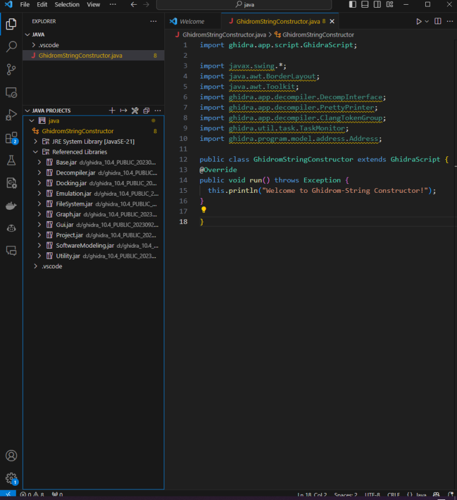

# GhidrOM: Object Mapping Extension for Ghidra

By Brian Nguyen, Maria Matamoros, Tianxiu Zhou and Vyom Gupta

December 18, 2023

## How to Use

Tested with Ghidra 10.4.

1. Load the script `GhidrOMString.java` to Ghidra
   - Open the script manager, create a new Java Ghidra script and copy the contents
   - Or import the folder containing this script to Ghidra
2. Use the script manager to run it. The modified C code will be displayed in a new window

## The RE Problem We Want to Address

Ghidra is a powerful static analysis tool. However, it is also noticeable that it is not very capable of handling object-oriented programming related syntax. For example, consider the following simple statements that declares and initializes a string:

```c++
std::string s;
s = “Hello, World!”;
```

The alternative source code produced by Ghidra goes as follows:

```c++
std::__cxx11::basic_string<>::basic_string();
         /* try { // try from 00101282 to 001012ae has its CatchHandler @ 001012d3 */
std::__cxx11::basic_string<>::operator=(local_48,"Hello, World!");
```

By examining the decompiled assembly code, it can be inferred that `local_48` in the alternative source code represents the original variable `s`. However, the first reversed statement gives no information about the assigned variable, introducing inconvenience or even confusion to the reverse engineering task.

While the previous example is concerned with object creation (calling of the constructor method), it may represent a broader range of problems about how Ghidra handles the calling of object methods, where the objects being referenced are not easily revealed in a human-friendly way. For example, also consider the size method of string objects:

Original source code:

```c++
int l = s.size();
```

Ghidra reversed source code:

```c++
int iVar1;
iVar1 = std::__cxx11::basic_string<>::size();
```

Where the reversed source code by Ghidra fails to show the object `s` from which `size()` is being called.

Such problems impose a significant drawback to the readability of Ghidra’s reversed alternative source code, and the current common solution to them is to look into the reversed assembly code to determine the arguments passed to the methods and infer the object being referenced. If the inference process can be automated, both the quality of Ghidra’s reversed source code and the efficiency of reverse engineering tasks will be boosted. Thus, the authors propose to build an extension to the Ghidra software, in order to allow it to properly illustrate the referenced object in the produced alternative source code when methods of class origins are involved. Specifically, the following behavior is expected should the extension be applied to the Ghidra software:

- For constructor methods, the variable to which the generated object reference is passed should be revealed. For example, code snippets as follows are expected in the reversed alternative source code:

  ```c++
  std::string s(“Hello, World!”);
  std::string s = “Hello, World!”;
  ```

- For other methods, the object being referenced should be revealed. As seen in previous cases, Ghidra fails to provide the object for which the function is being called, thus we propose the function calls being linked to a specific object. For example, code snippets as follows are expected in the reversed alternative source code:

  ```c++
  int l = s.size(); // s is an object of std::string
  server.run(); // server is an object of a custom class Server
  std::string name = student->getName(); // student is a pointer to an object of a custom class Student
  ```

## Achievements

Our group has adopted a step-by-step approach to make a solution to the object mapping problem. For the very first step, we targeted just 4 specific methods of the string class from the standard library: constructor, `size`, `operator[]` and `operator+=`, and this is what are presented in the `GhidrOMString.java` script.

The algorithm goes as follows:

1. Decompile the current function (where the cursor is located) using the `DecompInterface` class.

2. Loop through the decompile result, construct the C code along the way.

   - Flatten the decompile result, which by default is a tree, into an array of tokens. Each token is part of the decompiled C code.

   - Determine the entity of the token by checking its immediate class. For example, tokens which are instances of the `ClangBreak` class represents line breaks and the indentation in C code. Watch for the `ClangFuncNameToken` class, and use their `toString` methods to check whether the function name token represents one of the target methods.
   - When the target methods are met, acquire the corresponding assembly code using the `getInstruction` API provided by Ghidra.
   - Use the assembly code to determine the object mapping, and modify the C code to a more readable version.

3. Print the analysis result in a new GUI window, using Java swing.

## Lessons

### Choice of the Scripting Language

To our best knowledge, there are three language choices to write Ghidra scripts: Java, Python 2 and Python 3.

Java is supported by nature because Ghidra itself is written in Java. There is also a built-in Python 2 interpreter (which could be deleted in future versions) which is based on Jython to run Python 2 scripts in JVM. However, Python 2 has been so outdated and we believe it would not be the first choice for most people nowadays. It's possible to write Ghidra scripts using Python 3, but it's not officially supported and you will need an extension like [Ghidrathon](https://github.com/mandiant/Ghidrathon), [ghidra_bridge](https://github.com/justfoxing/ghidra_bridge) and others. The problem with these extensions is the complexity of installation and compatibility issues that you will probably run into if you are using older versions of Windows 10, or ARM-based computers, or ... Also, these extensions often have their own dialects to access the Ghidra API which may add unwanted extra learning overhead to your development.

Considering all the issues mentioned above, here we recommend using Java to write Ghidra scripts. Despite the seemingly "complicated" syntax compared with Python, writing in Java can "force" you to dive into the various classes of the Ghidra framework and make you to better understand how Ghidra works under the hood. With explicit types, it's also easier to debug and find references.

### Add IntelliSense

One advantage of using Java to write Ghidra scripts is that you can add use the "IntelliSense" ability of your IDE to get class and method definitions, which  is very likely to speed up your development a lot. To do so, you can

1. Use eclipse and follow Ghidra's [developer instructions](https://github.com/NationalSecurityAgency/ghidra/blob/master/DevGuide.md)

2. Or, you can manually identify the necessary jar libraries and add them to your class path. For example, if you are using VS Code, you can add the jar libraries in your Ghidra installation to your 'referenced libraries' in the 'Java project section', so that you can get rid of the syntax errors because of unresolved import statements and get auto-fill support:

   

   The necessary jar libraries are dispersed across the folder of your Ghidra installation, like `ghidra_10.4_PUBLIC/Ghidra/Features/Base/lib`. Try to look at the `Ghidra/Features` and `Ghidra/Framework` folders

### Where to Find Documentation, Tutorials, ...

It's a little annoying that there are very limited resources where you can learn about Ghidra scripting, and most of the available ones are very outdated. That's why we recommend studying [Ghidra's official Javadoc documentation](https://ghidra.re/ghidra_docs/api/) in the first place. Unfortunately, the Javadoc website can also be outdated, and the information it provides can also be insufficient. At these times, you can try to read [Ghidra's source code on Github](https://github.com/NationalSecurityAgency/ghidra). Use the code search functionality wisely!

